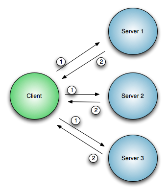

!SLIDE center
# What is "Event Driven Programming"? #

!SLIDE center bullets
# Think GUIs

* Sit and wait for something to happen
* "Main Loop" -- nothing else to do

!SLIDE center bullets
# Synchronous Code

* One Server (process) per Client
* Think `apache`

!SLIDE center bullets
# Event-driven code

* One Server, many clients
* Think `nginx`

!SLIDE center bullets
# Under the hood

* `epoll`, `kqueue`
* Kernel tracks the "clients", not our process
* O(1) vs O(n), callbacks instead of lists

!SLIDE center bullets
# When to use it?

* I/O Wait >> "Think Time"
* Awesome for network, I/O  heavy work

!SLIDE center
# Basic Sync Operation
## One server at a time

!SLIDE center
# Sync Runtime
# `SUM(S1, S2, S3, ... SN)`

!SLIDE center
# Basic Async
## Ask All Servers
## Process all answers

!SLIDE center
# Async Runtime
# `MAX(S1, S2, S3 ... SN)`

!SLIDE bullets incremental
# TMTOWTDI
## Other strategies for this workload

* Threads ([Coro](http://search.cpan.org/dist/Coro/))
* Lots of others: [c10k](http://www.kegel.com/c10k.html)
* *(c10k techniques still work; c1M on modern hardware)*

